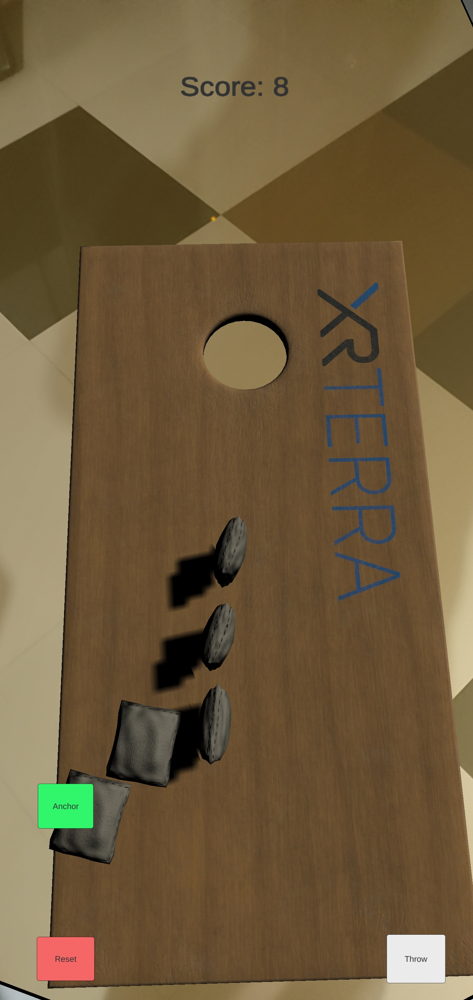

# AR-Beanbag-Toss
 
An augmented reality project created as part of [XRTerra's AR & VR Developer Program](https://xrterra.com/programs/developer/).

## Decription

This application is an augmented reality rendition of the popular cornhole/beanbag toss game, for Android phones with ARCore compatibility (this list can be found [here](https://developers.google.com/ar/discover/supported-devices)). The application will detect planes using the camera, on which a cornhole board can be placed. A beanbag can be thrown on the board using the Throw button on the UI; the board can be re-anchored and the game reset using the Anchor and Reset buttons, respectively. A score field at the top of the UI is updated after every valid throw, with +1 points for every throw on the board, and +3 for every throw into the hole. The throw location can be changed by moving around with the phone.

## Installation

An .apk file can be found in the Builds folder.

## Built With

* [Unity](https://unity.com/)
  * Version: 2019.4.2f1
* [Microsoft Visual Studio Code](https://code.visualstudio.com/)
  * Version: 2019
  
## Development Setup

The system requirements can be found [here](https://docs.unity3d.com/Manual/system-requirements.html).

## Contact
 
Daniel Sharvaaya Dash - daniel.s.dash@gmail.com
 
Project Link: https://github.com/drash7/AR-Beanbag-Toss
 
## Contributing
 
I greatly appreciate any contribitions.
1. Fork the Project
2. Create your Feature Branch (`git checkout -b feature/CoolFeature`)
3. Commit your Changes (`git commit -m 'Add some CoolFeature'`)
4. Push to the Branch (`git push origin feature/CoolFeature`)
5. Open a Pull Request
